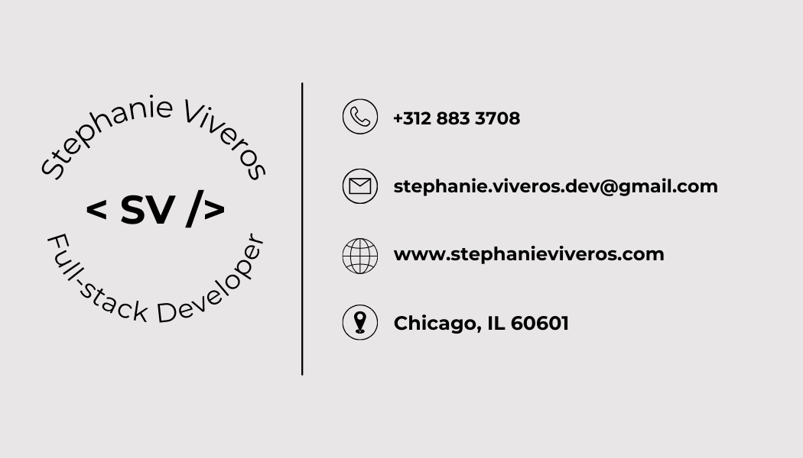

    "/>

 <h2>Tech</h2>

<!-- ---
 -->

<!---
stephanie-viveros/stephanie-viveros is a ✨ special ✨ repository because its `README.md` (this file) appears on your GitHub profile.
You can click the Preview link to take a look at your changes.
--->
